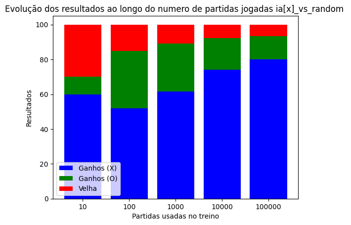

# Reinforcement Learning Aplicado ao Jogo da Velha

Este repositório utiliza o algoritmo **Q-learning** para ensinar a jogar o Jogo da Velha. A implementação de cada componente necessário para o Q-learning está organizada em classes.

- **game_model:** Nesta classe, encontra-se a implementação do modelo do jogo em si, permitindo a interação com o jogo e os métodos relativos ao tabuleiro do jogo.

- **environment:** Nesta classe, o ambiente de aprendizado é definido. Aqui, o `q_agent` interage com o modelo de jogo e é atualizado através das iterações.

- **Q-learning agent:** Nesta classe, é implementado o agente de Q-learning, juntamente com seus métodos de aprendizado e atualização.

Para treinar o `q_agent`, utiliza-se o código em `run.py` que possibilita a configuração do experimento, como os valores de epsilon, alpha, fator de desconto e o número de jogos que o agente terá para aprender. O número de jogos fornecidos será jogado para cada modalidade de jogo, que são:
- IAvsIA
- IA[x]vsRandom
- IA[o]vsRandom

Após o treinamento do modelo, ele é salvo em um arquivo JSON com os valores da q_table, cujo nome especifica as configurações do experimento.
E após cada treinamento, o modelo passa por uma etapa de teste de 1000 jogos em cada modelidade

Para jogar contra o modelo, basta usar o código `play.py` e indicar onde está o arquivo de configuração do `q_agent` com a flag `--file_name`.

## Analise 
Para analise de resultados avaliei os resultados obtidos com o treinamento do q agent com 10,100,1000,10000,100000 jogos ,e com os seguintes parametros: alpha 0.6, epsilon = 0.5, discount_factor = 0.7
Avaliando os resultados no treinameno 

Com os resultados acima do agente jogando contra si mesmo, percebe-se, um numero maior de partidas jogadas não melhorou os resultados, com o agente(x) ganhando um pouco mais que o agente(o) e resultando em poucos empates

Ao avaliarmos o agent(x) contra o agente aleatorio, percebe-se que ele passa por uma piora de 10 a 100 partidas jogadas, mas volta a melhorar com o crescimento das partidas jogadas, conseguindo ganhar por volta de 80% das vezes do agente aleatorio(o) e tendo poucos empates 

Este código é **Open Source**, sinta-se livre para usar, modificar e distribuir.

Avaliando os resultados do agente(o) contra o agente(x) aleatorio percebe-se que conforme o numero de partidas cresce, ele consegue equilibrar mais o jogo ganhondo mais vezes do agente(x) aleatorio e tendo mais empates

Analise teste 

