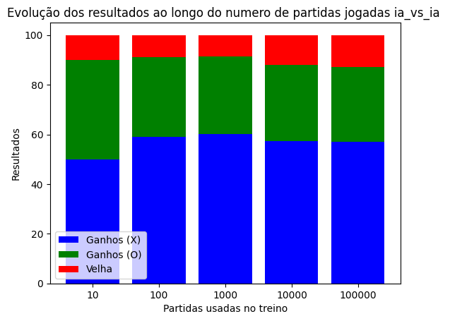
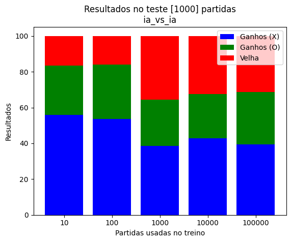
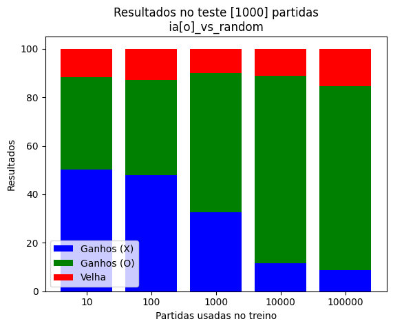

# Reinforcement Learning Aplicado ao Jogo da Velha 

<h2>Este repositório utiliza o algoritmo Q-learning para aprender jogar o Jogo da Velha .</h2>

Com o objetivo de iniciar meus estudos aprendizado por reforço, desenvolvi este projeto da implementação de um agente Q-learning aplicado ao Jogo da Velha. Utilizei Python para criar um ambiente de aprendizado onde um agente aprendeu a jogar o Jogo da Velha contra diferentes estratégias, como adversários aleatórios e até mesmo contra si mesmo.

Para o desenvolvimento do codigo estruturei classes para o modelo de jogo, ambiente e o agente Q-learning.O agente foi treinado  ajustando os parâmetros de aprendizado, como taxa de aprendizado e fator de desconto, para maximização dos resultados.

Após o treinamento, avaliei o desempenho do agente em confrontos contra oponentes aleatórios e suas próprias iterações. Isso me proporcionou uma compreensão prática de como o Q-learning pode ser aplicado a um cenário simples como o Jogo da Velha e detalhes técnicos de sua implementação. 


A implementação de cada componente necessário para o Q-learning está organizada nas seguintes classes
- **game_model:** Nesta classe, encontra-se a implementação do modelo do jogo em si, permitindo a interação com o jogo e os métodos relativos ao tabuleiro do jogo.

- **environment:** Nesta classe, o ambiente de aprendizado é definido. Aqui, o `q_agent` interage com o modelo de jogo e é atualizado através das iterações.

- **Q-learning agent:** Nesta classe, é implementado o agente de Q-learning, juntamente com seus métodos de aprendizado e atualização.

Para treinar o `q_agent`, utiliza-se o código em `run.py` que possibilita a configuração do experimento, como os valores de epsilon, alpha, fator de desconto e o número de jogos que o agente terá para aprender. O número de jogos fornecidos será jogado para cada modalidade de jogo, que são:
- IAvsIA
- IA[x]vsRandom
- IA[o]vsRandom

O treinamento começa jogando n partidas com IA[x]vsRandom em seguida, n partidas com IA[o]vsRandom e em seguida n partidas IA[x]vsIA[o], isso é feito para que o modelo primeiro explore os estados de x e o contra o agente aleatorio e desenvolvem estrategias, e após isso refinam essas estrategias jogando contra si mesmos 

Exemplo de treinamento de um modelo usando `run.py`:

    ```
    python run.py --rounds 7000 --epsilon 0.6 --alpha 0.4 --discount_factor 0.9
    ```


Após o treinamento do modelo, ele é salvo em um arquivo JSON com os valores da q_table, cujo nome especifica as configurações do experimento.
E após cada treinamento, o modelo passa por uma etapa de teste de 1000 jogos em cada modelidade

Para jogar contra o modelo, basta usar o código `gradio_game.py` e indicar onde está o arquivo de configuração do `q_agent` com a flag `--file_name`.

## Analise 

<h3>Treino</h3>
Para  treinamento foram testados o q agent o seguintes parametros de aprendizado: com 10,100,1000,10000,100000 jogos ,e com os seguintes parametros: alpha 0.6, epsilon = 0.5, discount_factor = 0.7. Avaliando a evolução do treino conforme o numero de partidas:



Com os resultados acima do agente jogando contra si mesmo, percebe-se, um numero maior de partidas jogadas não melhorou os resultados, com o agente(x) ganhando um pouco mais que o agente(o) e resultando em poucos empates


Ao avaliarmos o agent(x) contra o agente aleatorio(o), percebe-se que ele passa por uma piora de 10 a 100 partidas jogadas, mas volta a melhorar com o crescimento das partidas jogadas, conseguindo ganhar por volta de 80% das vezes do agente aleatorio(o) e tendo poucos empates 


Avaliando os resultados do agente(o) contra o agente(x) aleatorio percebe-se que conforme o numero de partidas cresce, ele consegue equilibrar mais o jogo ganhondo mais vezes do agente(x) aleatorio e tendo mais empates

<h3>Teste</h3>

Para analise dos resultados em teste o modelo foi testado em 1000 partidas, com epsilon = 0 isso implica que ele não fará explorações e portanto ira jogar com seu melhor movimento para cada estado.

IA[x] vs IA[O]



Avaliandos os resultados desse teste, o agente(o) perde mais vezes com um pouco numero de jogos para treino, conforme as rodadas de treino aumentam ele começa ficar melhor e começa a ganhar mais vezes, além disso o numero de empates também aumenta

IA[x] vs random[O]

O agente(x) mesmo com poucas rodadas de treino ja ganha muitas partidas contra o agente aleatorio o, ganhando 70% das vezes com apenas 10 rodadas de treino, e conforme o numero de rodadas aumenta ele fica muito bom ganhando até 97,7% das partidas 


IA[O] vs random[X]



O agent o começa equilibrado com o agente(x) aleatorio e conforme o numero de partidas no treino aumenta ele fica melhor ganhando mais vezes e empatando mais também, porém não consegue atingir o mesmo nivel de resultado do agente(x)


Avaliando os resultados como um todo, fica claro que o agente(x), tem uma vantagem por começar primeiro, mas conforme os agentes aprendem, o agente(o) começa conseguir empatar ou ganhar mais vezes


<h3>Este código é Open Source, sinta-se livre para usar, modificar e distribuir.</h3>